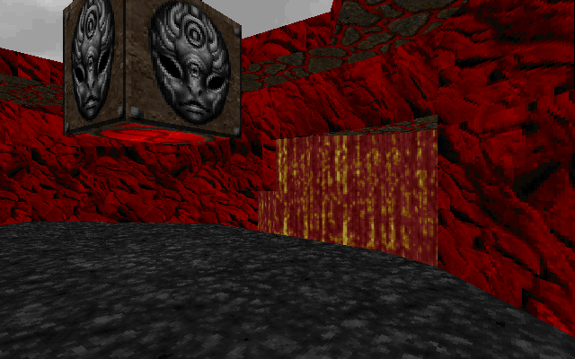
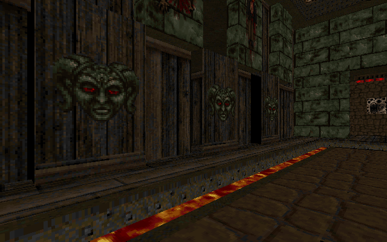
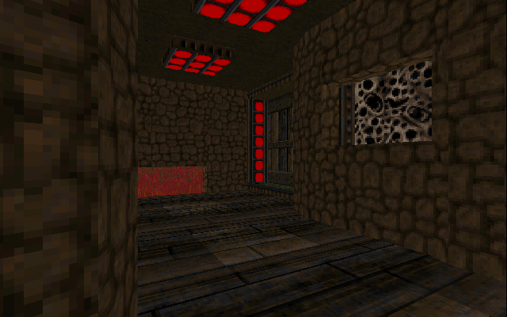
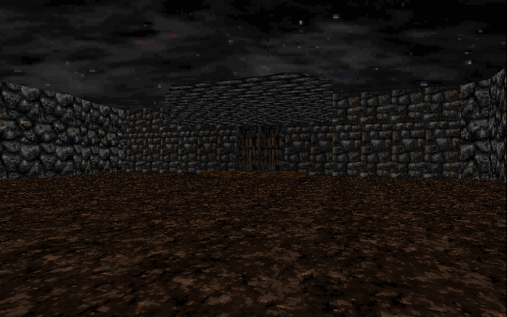
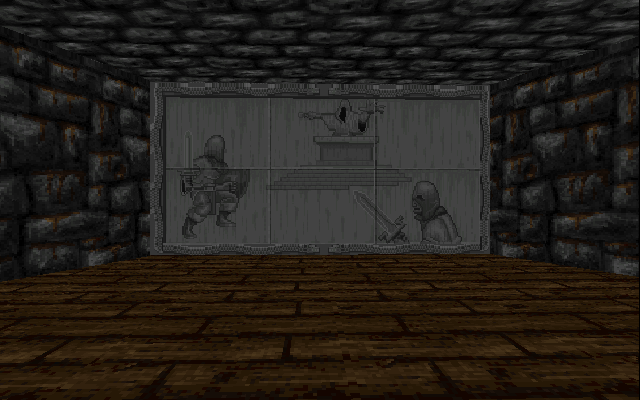
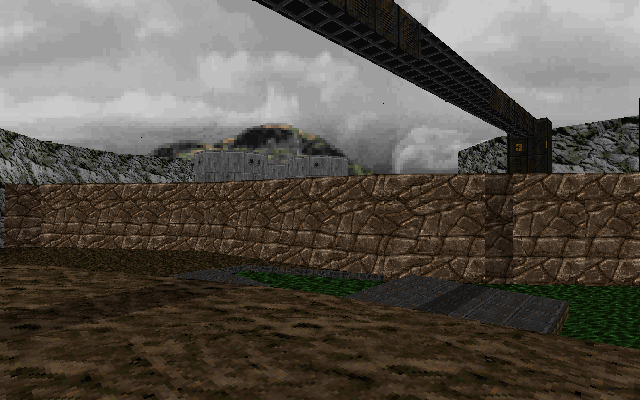
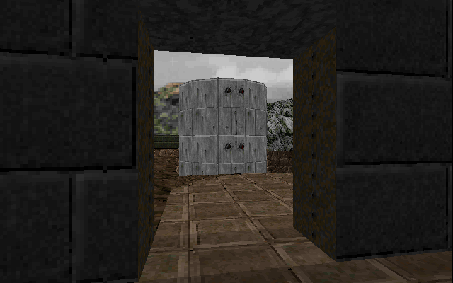
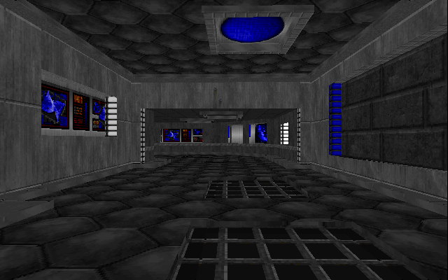

# Intro
Bsp.jl is an implementation of the Binary Space Partioning rendering algorithms that powered Doom in 1993. This project is being done as a part of EvoGL, an effort to retrace the evolution of 3d graphics techniques in the Julia language. See the other render projects <link raycaster> <link rasterizer>, soon.

# Features
- Fully functional level renderer for Vanilla Doom and Doom2 bases wads and mods.
- Working "automap".
- Blockmap collisions.
- Player controller with gravity and accelration.
- In game photography system, used to snap the screenshots below.
- Partial support for wad patching. Not all wad formats are supported. (Doom sourceports are many and varied.)


# Showcase










# Usage
```julia
    include("src/Bsp.jl")
    Bsp.run(["wads/DOOM1.WAD"], "E1M1")
```
- w,a,s,d to move
- e to take photo
- f to fullscreen
- r to turn on and off collisions
- t to show fps
- tab to show automap, with g to showblockmap

# Todo
See todo.txt

# Credits
* Thank you ID software for open sourcing doom for the world to enjoy, share and study.
* Thank you Fabian Sanglard for your work on Doom Game Engine Black book, https://fabiensanglard.net/gebbdoom/
* Thank you DIY Doom project https://github.com/amroibrahim/DIYDoom
* Thank you Coder Space for your doom engine youtube videos https://www.youtube.com/watch?v=XV-cSvFM3ak&t=589s
* Thank you Freedoom Project for your lovely work on the freedoom wad replacements for the original doom. https://freedoom.github.io/
